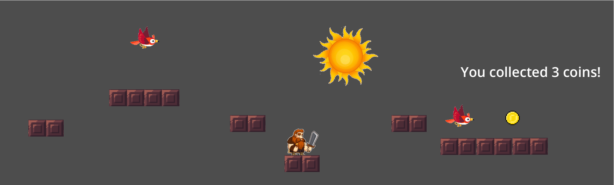

This is the Assignment1 for Xueqi Cheng

## Introduction

The assignment is to create a 2D platformer game using Godot. The game is to control the warrior to reach the final point through platforms while getting as many coins as possible. There are enemies (birds) in the game, and the player should avoid touching them. Some platforms are moving. The game is over when the player touches the enemy or falls off the platform. The project is written on MacOS with M4 chip.

## Screenshot

Here is a screenshot of the project:



## How to play
The player can use the arrow keys to move the warrior. The player can jump by pressing the space key. 

## How to run the project
1. Download the project from the repository, or clone it using git:
``` git clone https://github.com/Vanderbilt-GameDev-2025/Assignment1-Xueqi-Cheng.git ```
2. Open the project in Godot.
3. Click the play button on the top-right corner to run the project.

